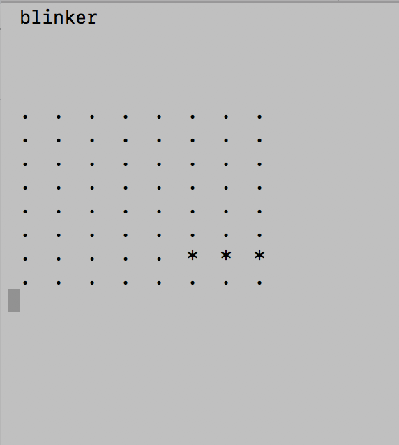

### Conway
		
 source file:
 
    conwaytl.c
 Goals:
 
    Conway simulation.

 Usage example:
 
	only tested under linux environment.
	compile:
	 		gcc -o conwaytl  -std=c99 -Wall conwaytl.c
	run:
			./conwaytl toad
			./conwaytl glidER
			./conwaytl
	stop:
			press Ctrl-C to exit.
	
 Reference:
 
	https://en.wikipedia.org/wiki/Conway%27s_Game_of_Life
	
Example:

  
